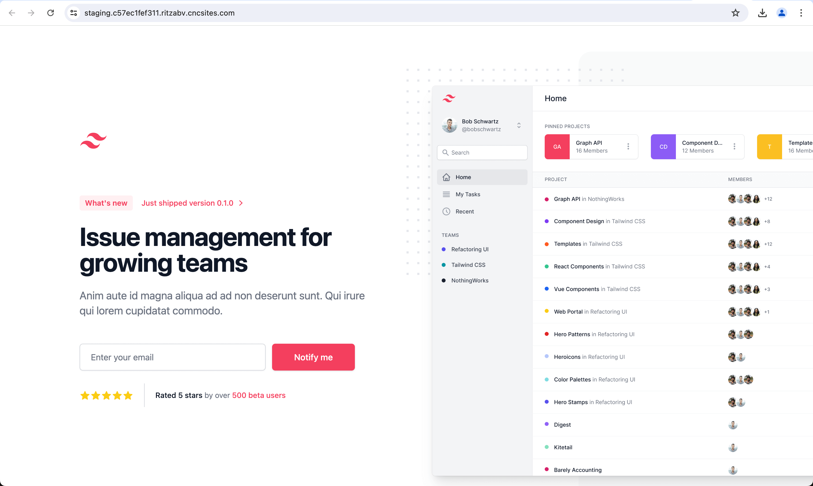

  

  <i>The Next Generation Developer Platform</i>  
  <a href="https://withcoherence.com">withcoherence.com</a>

<h1 align="center">
  React example
</h1>

 

## Demo React Application

This is the code to accompany the tutorial available at <a href="https://docs.withcoherence.com/getting-started/quickstart-react-app">https://docs.withcoherence.com/getting-started/quickstart-react-app</a>

You can deploy a basic React application built with Vite and Tailwind. It looks like this.

Deploy and scale applications on your own cloud infrastructure at **[Coherence](https://withcoherence.com)**.

Read our documentation at [docs.withcoherence.com](https://docs.withcoherence.com/).
